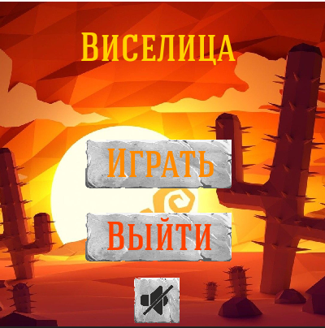
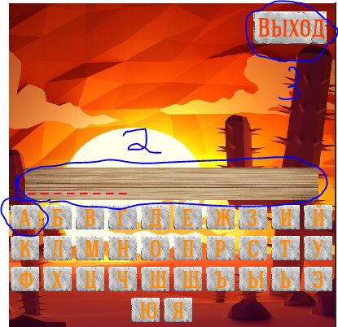

# Лучшая игра Виселица на Pygame

Открыв игру вы попадаете в меню:

*(Меню рис. 1)*

## Разберём кнопки в меню
1) Первая кнопка - начинает игру
2) Вторая кнопка - выход из программы
3) Выключить музыку

## Разбор иры
Нажав "Играть", вы попадаете в игру.
У вас есть 8 попыток, чтобы отгадать слово

*(Игра рис. 2)*

Цифрой 1 на снимке обозначена кнопка с буквой. Если нажать на эту кнопку или на любую такую-же, то либо на ней появиться крестик, либо эта буква появится в поле под номером 2.

*(Крестик рис.3)*

За каждый крестик у вас отнимается одна "жизнь". Этих "жизней" у вас 8.
Если вы потратите все ваши "жизни", то вы проиграете и на экране появится загаданное слово.

*(Экран проигрыша рис.4)*

На рис. 2 цифрой 3 обозначена кнопка выхода, нажав на которую игра закроется.

Если же вы победите, то вам покажется соответсвующее окно, с поздравлением. Под текстом в меню проигрыша и в меню выигрыша есть кнопка "Ещё", нажав на которую игра начнётся заново.

# Что планируется добавить в версии 0.0.2?
В этой версии планируется:
1) Возможность выключить звук
2) Возможность загрузить свои текстуры
3) Картинка "Виселицы"
4) Страница рекордов
5) Настройки

Я _**НЕ ОБЕЩАЮ**_  добавить _**ВСЁ**_, написанное выше! 